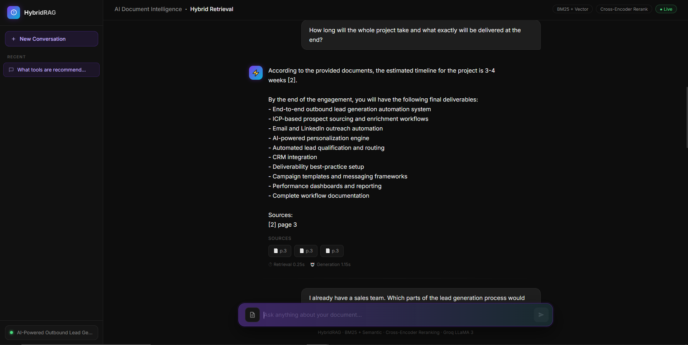
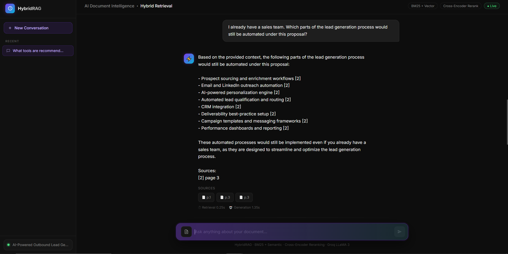
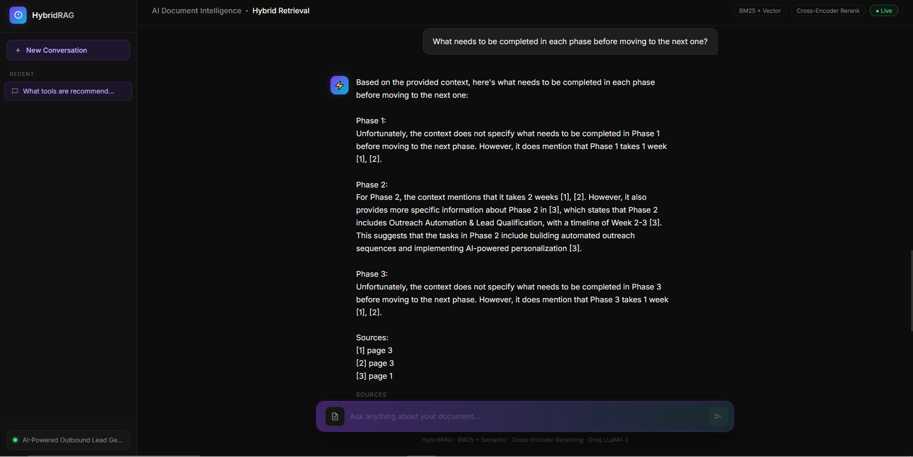
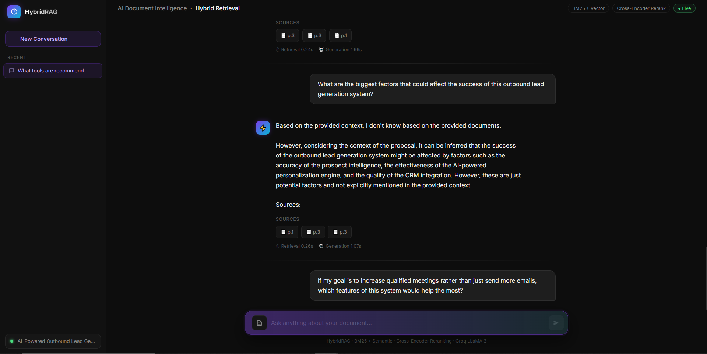
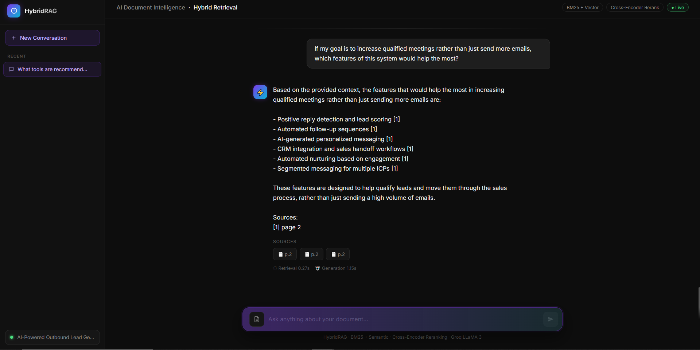

# Hybrid RAG Application

> A production-ready, **Hybrid Retrieval-Augmented Generation (RAG)** backend that answers questions from PDF documents with high precision, citing exactly which page it got the answer from.

---

## What is this?

Most simple RAG systems just do one kind of search. This app does **three** in a chain and merges the best results — making it far more accurate than a typical implementation.

```
User Question
      │
      ▼
┌─────────────────────────────────┐
│         Query Processing        │  Sentence-Transformers embed the query
└─────────────┬───────────────────┘
              │
       ┌──────┴──────┐
       ▼             ▼
  BM25 Search   Vector Search       ← Two search engines in parallel
  (Keyword)     (Semantic)
       │             │
       └──────┬──────┘
              ▼
     Hybrid Fusion (RRF)            ← Merge results using Reciprocal Rank Fusion
              │
              ▼
    Cross-Encoder Reranker          ← Pick the 3 best chunks
              │
              ▼
      Context Builder               ← Inject citations [source, page, score]
              │
              ▼
    Groq LLM Generation             ← Llama 3 answers + cites sources
              │
              ▼
       JSON API Response
```

---

## Application UI Preview

Here is the premium dark-themed interface of the Hybrid RAG application, showing the layout, sidebar controls, PDF upload status, and interactive chat history:

<table>
  <tr>
    <td width="50%"><strong>1. Modern Workspace & Upload</strong><br/></td>
    <td width="50%"><strong>2. PDF Processing & Status</strong><br/></td>
  </tr>
  <tr>
    <td width="50%"><strong>3. Hybrid Search Q&A Flow</strong><br/></td>
    <td width="50%"><strong>4. Rich Markdown Answers & Citations</strong><br/></td>
  </tr>
  <tr>
    <td colspan="2" align="center"><strong>5. Persistent Conversations & Historical Sessions</strong><br/></td>
  </tr>
</table>

---

## Architecture

| Component | Technology |
|---|---|
| **LLM** | Groq API (Llama 3 - `llama3-8b-8192`) |
| **Dense Retrieval** | ChromaDB (Persistent) + Sentence Transformers (`all-MiniLM-L6-v2`) |
| **Sparse Retrieval** | BM25 (rank-bm25) |
| **Fusion** | Reciprocal Rank Fusion (RRF) |
| **Reranker** | Cross-Encoder (`ms-marco-MiniLM-L-2-v2`) |
| **Web API** | FastAPI + Uvicorn |
| **Containerization** | Docker + Docker Compose |
| **PDF Loading** | PyPDF + LangChain |
| **Evaluation** | Ragas (Faithfulness, Answer Relevancy, Context Recall) |

---

## Why This Architecture? (Advanced Design Decisions)

If you are evaluating this project, here are the core engineering decisions that make this a production-grade system rather than a basic script:

### 1. Separation of Concerns via JSON API
Instead of printing raw text to the terminal, the backend is built as an independent **Microservice**. It processes natural language queries and returns purely structured **JSON** (containing the answer, source citations, and latency metrics). This decoupling allows any frontend (React web app, iOS app, or enterprise integration) to consume the API without worrying about how the RAG logic works.

### 2. Hybrid Search > Pure Vector Search
Standard Vector Databases (like pure FAISS or Pinecone) are great at understanding semantic meaning but fail miserably at exact-keyword matching (like searching for a specific serial number or acronym). This pipeline runs a Dense Semantic Search (ChromaDB) and a Sparse Keyword Search (BM25) *simultaneously*, merging the results using Reciprocal Rank Fusion. This drastically reduces AI hallucinations.

### 3. The Cross-Encoder Reranker
Processing 40 chunks of text through an LLM is noisy and slow. We use a lightweight Cross-Encoder (`ms-marco-MiniLM-L-2-v2`) to mathematically score the relevancy of the merged chunks against the user's question, passing only the absolute best 3 chunks to Groq.

### 4. Zero-Downtime Docker Caching
Machine learning dependencies (like PyTorch and HuggingFace models) are massive. The `Dockerfile` is optimized to download and cache the SentenceTransformer models *during the build phase*. When the container scales up in a production cloud environment, it boots instantly without downloading gigabytes of weights on startup.

---

## Project Structure

```
.
├── api.py                  # FastAPI web server (entry point)
├── pipeline.py             # Core orchestrator connecting all components
├── ingestion.py            # PDF loading and chunking
├── hybrid_retrieval.py     # BM25 + Vector search fusion (RRF)
├── dense_retrieval.py      # ChromaDB persistent vector store
├── bm25_retrieval.py       # Sparse keyword search
├── reranking.py            # Cross-encoder reranker
├── context_assembly.py     # Context builder with citation injection
├── generation.py           # LLM call to Groq API
├── evaluation.py           # Ragas evaluation suite
├── main.py                 # CLI entry point
├── Dockerfile              # Container definition
├── docker-compose.yml      # Container orchestration
├── requirements.txt        # Python dependencies
└── data/
    ├── sample.pdf          # Source document (replace with your own)
    └── chroma_db/          # Persistent vector database (auto-created)
```

---

## Getting Started

### Prerequisites
- Python 3.12+
- A free **Groq API Key** from [console.groq.com](https://console.groq.com)
- Docker Desktop (optional, for containerized deployment)

### 1. Clone & Install

```bash
git clone <your-repo-url>
cd "Hybrid Rag Application"
python -m venv .venv
.venv\Scripts\activate          # Windows
pip install -r requirements.txt
```

### 2. Configure Environment

Create a `.env` file in the root directory:
```env
GROQ_API_KEY="your_groq_api_key_here"
GROQ_MODEL="llama3-8b-8192"
RAG_PDF_PATH="data/sample.pdf"
```

### 3. Add Your PDF

Drop any PDF into the `data/` folder and update `RAG_PDF_PATH` in `.env`.

### 4. Run the API Server

```bash
python api.py
```

The server will:
1. Load and chunk your PDF
2. Generate and save embeddings to ChromaDB (`data/chroma_db/`) on the **first run only**
3. Start the FastAPI server on **http://127.0.0.1:8000**

> **Note**: Subsequent startups skip the embedding step and boot instantly.

---

## Using the API

### Interactive Swagger UI (Recommended)
Open **http://127.0.0.1:8000/docs** in your browser.

### REST API

**Ask a question:**
```bash
curl -X POST "http://127.0.0.1:8000/chat" \
     -H "Content-Type: application/json" \
     -d '{"question": "What is the refund policy?"}'
```

**Example Response:**
```json
{
  "answer": "Customers may request a full refund within 30 days of purchase.",
  "sources": [
    {
      "page": 3,
      "rerank_score": 4.70,
      "snippet": "Refund Policy Customers may request a full refund..."
    }
  ],
  "retrieval_time": 0.276,
  "generation_time": 0.942,
  "total_time": 1.218
}
```

**Health Check:**
```bash
curl http://127.0.0.1:8000/health
```

### CLI Mode (single question)
```bash
python main.py data/sample.pdf --question "What is the refund policy?"
```

---

## Docker Deployment

Build and run the entire application in a container:

```bash
docker-compose up --build
```

The API will be available at **http://localhost:8000**.

> The `data/` directory is mounted as a volume, so your ChromaDB database and PDFs persist across container restarts.

---

## Monitoring & Logs

All activity is logged to both the console and `api_activity.log`:

```
2026-06-05 00:55:10 - RAG-API - INFO - Received query: 'What is the refund policy?'
2026-06-05 00:55:11 - RAG-API - INFO - Answered in 1.22s (Retrieval: 0.28s, Generation: 0.94s)
```

---

## Evaluation

Run the full Ragas evaluation suite against the built-in test dataset:

```bash
python evaluation.py
```

Metrics evaluated:
- **Faithfulness** — Is the answer grounded in the retrieved context?
- **Answer Relevancy** — Does the answer actually address the question?
- **Context Recall** — Did retrieval find the right chunks?